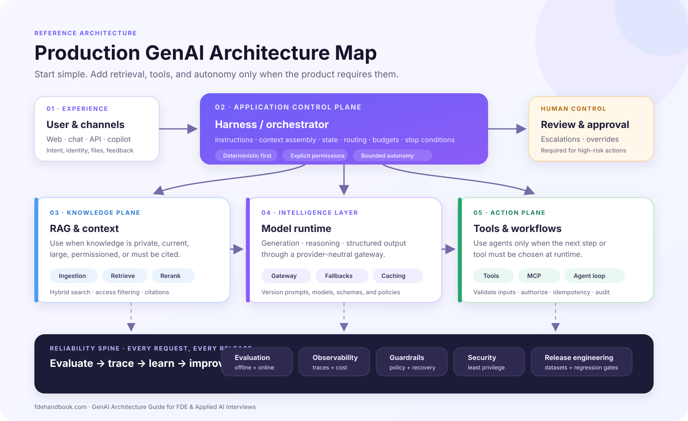

# GenAI Architecture Guide for FDE & Applied AI Interviews

Learn how to design and explain production GenAI systems—from model APIs and RAG to agents, evaluation, security, and operations.

This guide is written for **Forward Deployed Engineer (FDE)**, **Applied AI Engineer**, and **AI Engineer** candidates who need to reason about customer-facing AI systems, not memorize a fashionable framework.

**[Start the complete FDE GenAI course →](https://www.fdehandbook.com/learn/genai-architecture/overview?utm_source=github&utm_medium=referral&utm_campaign=genai_field_guide)**

The map separates the application control plane from retrieval, model runtime, and external actions. Evaluation, observability, guardrails, security, and release engineering span the entire system rather than appearing as afterthoughts.

## What makes this guide different

- **Architecture decisions, not framework tutorials.** Learn when to use a direct model call, RAG, a deterministic workflow, or an agent.
- **Production trade-offs, not toy chatbots.** Treat permissions, evaluation, latency, cost, observability, and recovery as part of the design.
- **Structured for system-design interviews.** Build the vocabulary and decision process expected in FDE and Applied AI interviews.
- **Connected to deliberate practice.** Continue into guided architecture scenarios, coding exercises, and an AI mock interviewer when you are ready to rehearse.

## Start here

1. [Why GenAI changes software architecture](01-foundations-of-genai-systems/1.1-from-traditional-software-to-genai-systems.md)
2. [What makes a system agentic?](01-foundations-of-genai-systems/1.3-what-makes-a-system-agentic.md)
3. [Model + Harness](01-foundations-of-genai-systems/1.4-model-plus-harness.md)
4. [RAG Architecture Pattern](03-genai-architecture-patterns/3.3-rag-architecture-pattern.md)
5. [Why AI Reliability Is Different](04-reliable-ai-systems/4.1-why-ai-reliability-is-different.md)

## Architecture pattern selection cheat sheet

Start with the simplest pattern that satisfies the requirement. Add autonomy only when the system genuinely needs to choose its path at runtime.

| Requirement | Start with | Add only when needed |
|---|---|---|
| Generate, classify, extract, or transform bounded input | Direct model call | Structured output and deterministic validation |
| Maintain a conversational interface | Chatbot | Explicit history selection and state |
| Answer from private, current, or citable knowledge | RAG | Hybrid retrieval, reranking, and access-aware filtering |
| Execute a known multi-step business process | Deterministic workflow | Model steps inside application-controlled transitions |
| Choose tools or next steps dynamically | Agentic workflow | Budgets, stop conditions, scoped permissions, and recovery |
| Perform an irreversible or high-risk action | Human approval | Audit evidence and explicit authorization before execution |

Before choosing a pattern, ask:

- Does the model already have the required information?
- Are the execution steps known in advance?
- Must the system take an external action?
- What is the cost of a plausible but wrong result?
- How will we evaluate, trace, recover, and stop it?

## Course contents

| Chapter | What it covers |
|---|---|
| [01 · Foundations of GenAI Systems](01-foundations-of-genai-systems/) | Six lessons, from traditional software to the new role of the engineer |
| [02 · Building Blocks of GenAI Systems](02-building-blocks-of-genai-systems/) | Models, context, retrieval, tools, MCP, state, memory, and permissions |
| [03 · GenAI Architecture Patterns](03-genai-architecture-patterns/) | Direct LLM, RAG, workflows, agents, skills, interoperability, and human review |
| [04 · Reliable AI Systems](04-reliable-ai-systems/) | Evaluation, security, guardrails, observability, governance, and readiness |
| [05 · Production-Grade GenAI Engineering](05-production-grade-genai-engineering/) | Specifications, production architecture, deployment, data, CI/CD, scale, and operations |

Every website subsection is stored as its own numbered Markdown file with the same lesson title.

## Open guide vs. complete handbook

This repository explains the core mental models and production principles. The complete FDE Handbook adds deeper course chapters, guided walkthroughs, runnable coding exercises, closed-book practice, progress tracking, and an AI mock interviewer.

Locked lessons use the same **Continue the course** or **Member chapter** boundary shown in the Handbook.

## Continue with practice

- [GenAI architecture scenarios](https://www.fdehandbook.com/practice/genai-architecture?utm_source=github&utm_medium=referral&utm_campaign=genai_field_guide)
- [Build an agent loop from scratch](https://www.fdehandbook.com/practice/coding/agent-loop-from-scratch?utm_source=github&utm_medium=referral&utm_campaign=genai_field_guide)
- [AI Mock Interviewer](https://www.fdehandbook.com/practice/mock/ai-interviewer?utm_source=github&utm_medium=referral&utm_campaign=genai_field_guide)
- [30-day FDE study plan](https://www.fdehandbook.com/learn/study-plan?utm_source=github&utm_medium=referral&utm_campaign=genai_field_guide)

The previous question-bank README is preserved in [`Forward-Deployed Engineer (FDE) Interview Prep/question-bank.md`](<Forward-Deployed Engineer (FDE) Interview Prep/question-bank.md>).

## License

Course content is available under [CC BY-NC 4.0](LICENSE). You may share and adapt it with attribution for non-commercial use. The synchronization script is available under the [MIT License](scripts/LICENSE).

Built for engineers preparing for Forward Deployed Engineer, Applied AI Engineer, Solutions Engineer, Customer Engineer, and Field Engineer roles.
